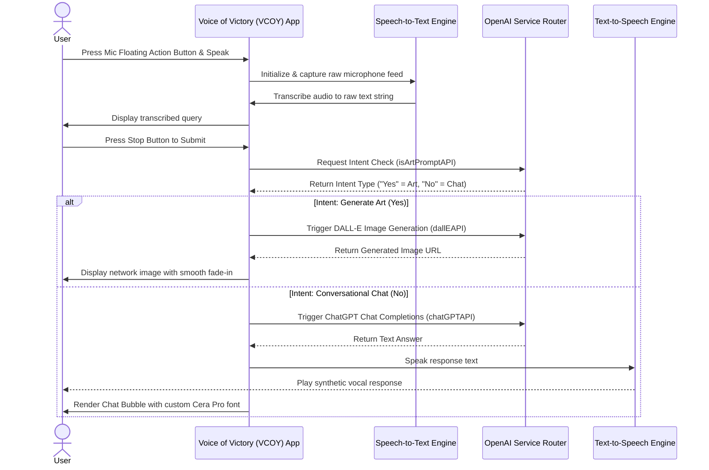

# 🎙️ Voice of Victory (VCOY) — Smart AI-Powered Voice Assistant

An elegant, voice-enabled Flutter application that acts as a multi-model personal assistant. It captures user speech, processes it, and determines the user's intent. If you want to have a conversation, it speaks back using **ChatGPT (GPT-3.5 Turbo)** and **Text-to-Speech (TTS)**. If you request art or images, it instantly visualizes it using **DALL-E** and renders the generated image on-screen.

The application boasts a premium, custom HSL color palette, custom **Cera Pro** typography, and smooth micro-animations that deliver an engaging, fluid user experience.

---

## 🌟 Key Features

*   **🎙️ Real-time Speech-to-Text**: Captures spoken inputs instantly using Flutter's native `speech_to_text` integration.
*   **🧠 Intelligent Intent Routing**: Employs an LLM-driven router to determine if a prompt is conversational or requests creative artwork, routing traffic automatically.
*   **💬 Context-Aware Chat**: Keeps history of conversations for realistic interaction using OpenAI's `gpt-3.5-turbo` model.
*   **🎨 AI Art Generation**: Directly hooks into the `images/generations` (DALL-E) endpoint to output premium graphics and graphics matching your spoken descriptions.
*   **🔊 Instant Text-to-Speech Response**: Converts text responses back to voice, speaking the answers aloud to the user using `flutter_tts`.
*   **✨ Premium Aesthetics**: Crafted with HSL-tailored colors, dynamic gradient visual styles, custom suggestion panels, and beautiful dark/light combinations.
*   **🎬 Micro-Animations**: Features fluid bounce, slide, zoom, and fade effects using `animate_do` to make the assistant feel alive and responsive.

---

## 🛠️ Application Flow & Architecture

The following diagram illustrates how user speech is routed, processed, and served by the application:



---

## 📁 Project Structure

The project has been organized following modern clean Flutter directory conventions:

```text
voice_assist_app/
├── assets/
│   ├── fonts/
│   │   ├── Cera-Pro-Bold.otf       # Premium font for bold headers & UI titles
│   │   └── Cera-Pro-Medium.otf     # Premium font for readable body text
│   └── images/
│       └── hii.png                 # Default smart AI Assistant avatar face
├── lib/
│   ├── main.dart                   # Application entry point, dark/light theme configs
│   ├── home_page.dart              # Core stateful widget handling Speech/TTS triggers and UI
│   ├── openai_service.dart         # Client routing requests to OpenAI's completion & image endpoints
│   ├── feature_box.dart            # Custom component card displaying suggestion details
│   ├── pallete.dart                # Central color system (curated blues, border tones)
│   └── secrets.dart                # API Keystore containing openAIAPIkey (ignored in production)
```

---

## 📥 Installation & Setup

Follow this comprehensive guide to set up and run the voice assistant on your local development machine or emulator.

### 📋 Prerequisites
*   **Flutter SDK**: Installed and configured (`flutter doctor` passes).
*   **OpenAI API Key**: A valid developer key with access to Chat Completions and DALL-E models.
*   **Hardware / Simulator**: An Android Emulator or iOS Simulator, or a physical mobile device with functional microphone hardware.

---

### Step 1: Clone the Repository
Open your terminal/command prompt and clone the repository:
```bash
git clone https://github.com/Rohanranga/voice_assist.git
cd voice_assist_app
```

---

### Step 2: Configure Your API Credentials
1.  Open the file [lib/secrets.dart](file:///r:/flutter/voice_assist_app/lib/secrets.dart) in your editor.
2.  Add your OpenAI API key to the placeholder string:
    ```dart
    const openAIAPIkey = 'sk-proj-yourActualOpenAiKeyHere';
    ```

> [!WARNING]
> Never commit your actual API keys to public repositories or GitHub. Keep `lib/secrets.dart` added in your `.gitignore` file to ensure credentials stay protected.

---

### Step 3: Platform-Specific Permissive Configuration

Because this application relies on low-level microphone hardware and speech transcription libraries, you must verify configurations for each platform:

#### 🤖 Android Configuration
The project is already pre-configured to handle package visibility and permissions. Inside `android/app/src/main/AndroidManifest.xml`, the following permissions are present:

*   **Permissions Required**:
    ```xml
    <uses-permission android:name="android.permission.RECORD_AUDIO"/>
    <uses-permission android:name="android.permission.INTERNET"/>
    <uses-permission android:name="android.permission.BLUETOOTH"/>
    <uses-permission android:name="android.permission.BLUETOOTH_ADMIN"/>
    <uses-permission android:name="android.permission.BLUETOOTH_CONNECT"/>
    ```
*   **Package Queries** (Required on Android 11+ to discover the Speech Recognition Service):
    ```xml
    <queries>
        <intent>
            <action android:name="android.speech.RecognitionService" />
        </intent>
    </queries>
    ```

#### 🍏 iOS Configuration
To launch and use the application on iOS devices, you must add the description strings detailing why microphone and speech processing are needed. Open the file [ios/Runner/Info.plist](file:///r:/flutter/voice_assist_app/ios/Runner/Info.plist) and append the following keys inside the `<dict>` tag:

```xml
<key>NSMicrophoneUsageDescription</key>
<string>This application requires access to the microphone to record your voice commands.</string>
<key>NSSpeechRecognitionUsageDescription</key>
<string>This application requires speech recognition permission to transcribe your voice commands into text.</string>
```

---

### Step 4: Install Dependencies & Build
Install all project plugins specified in the package pubspec:
```bash
flutter pub get
```

Ensure all assets and custom fonts are linked correctly. Once successfully resolved, execute the run command:

```bash
flutter run
```

---

## 📖 How to Use

1.  **Welcome Avatar**: Upon opening the application, the animated assistant greets you: *"Good morning, What task can I do for you?"*
2.  **Activate Voice Control**:
    *   Tap the **Microphone Button** in the floating action bar.
    *   The microphone icon changes, indicating active listening. Speak clearly into the device.
3.  **Submit Commands**:
    *   Once you finish speaking, tap the **Stop Button** to capture the input and submit it.
4.  **Interactive Outputs**:
    *   **Conversations (Chat GPT)**: If you ask a conversational question, a chat bubble appears and the assistant's synthetic voice will read the response out loud.
    *   **Art Generation (DALL-E)**: If you say *"Generate an image of a red panda wearing sunglasses"* or similar, the AI detects the creative intent, talks to DALL-E, and renders the high-quality generated image on-screen!
5.  **Re-activate**:
    *   Tap the microphone button at any point to clear the screen and start a brand-new assistant request.

---

## 📦 Principal Packages & Ecosystem

| Plugin Name | Version | Role in Ecosystem |
| :--- | :--- | :--- |
| **`speech_to_text`** | `^7.0.0` | Native speech recognition, transcribing live voice to string. |
| **`flutter_tts`** | `^4.0.2` | Converts textual responses back into synthesized audible voice files. |
| **`animate_do`** | `^4.2.0` | Lightweight animation framework injecting UI dynamism. |
| **`http`** | `^1.2.2` | Client making POST payloads to OpenAI's server gateways. |
| **`cupertino_icons`**| `^1.0.8` | Provides secondary utility icons. |

---

> [!TIP]
> Ensure your device is connected to a stable internet connection so the app can communicate smoothly with the OpenAI API. Happy voice assisting!
